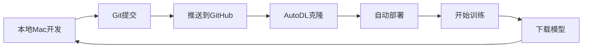

# GitHub + AutoDL 部署指南

通过GitHub中转部署到AutoDL云服务器的完整教程。

---

## 目录

1. [方案优势](#方案优势)
2. [GitHub上传步骤](#github上传步骤)
3. [AutoDL部署步骤](#autodl部署步骤)
4. [一键脚本](#一键脚本)
5. [常见问题](#常见问题)

---

## 方案优势

相比直接scp上传，通过GitHub中转有以下优势：

- ✅ **版本控制**: 代码有完整的版本历史
- ✅ **更快速**: AutoDL服务器下载GitHub速度快
- ✅ **可复现**: 可以在多台服务器部署相同版本
- ✅ **备份**: GitHub作为代码备份
- ✅ **协作**: 方便团队协作开发

---

## GitHub上传步骤

### 步骤1: 检查Git状态

```bash
cd /Users/ycy/Downloads/DQN_FruitMerger

# 查看状态
git status

# 查看远程仓库
git remote -v
```

### 步骤2: 添加部署文件

```bash
# 添加新创建的部署文件
git add \
    SERVER_DEPLOYMENT_GUIDE.md \
    DEPLOYMENT_README.md \
    GITHUB_AUTODL_GUIDE.md \
    deploy_server.sh \
    upload_to_server.sh \
    requirements_server.txt \
    .gitignore

# 或者添加所有修改
git add .
```

### 步骤3: 提交更改

```bash
# 创建提交
git commit -m "Add cloud deployment scripts and guides

- Add SERVER_DEPLOYMENT_GUIDE.md: Complete deployment guide
- Add deploy_server.sh: Auto deployment script for PyTorch 2.1.2 + CUDA 11.8
- Add upload_to_server.sh: Quick upload script
- Add requirements_server.txt: Server-specific dependencies
- Add DEPLOYMENT_README.md: Quick start guide
- Add GITHUB_AUTODL_GUIDE.md: GitHub + AutoDL deployment guide
- Update .gitignore: Exclude training logs, models, videos

Optimized for:
- GPU: RTX 3080 Ti (12GB)
- CUDA: 11.8
- Python: 3.10
- PyTorch: 2.1.2
- System: Ubuntu 22.04"
```

### 步骤4: 推送到GitHub

```bash
# 推送到远程仓库
git push origin main

# 如果是首次推送或没有设置upstream
git push -u origin main
```

**预计时间**: 1-2分钟

### 验证上传

访问你的GitHub仓库，确认文件已上传：
```
https://github.com/JoeyYu23/DQN_FruitMerger
```

检查这些文件是否存在：
- ✓ `deploy_server.sh`
- ✓ `SERVER_DEPLOYMENT_GUIDE.md`
- ✓ `requirements_server.txt`

---

## AutoDL部署步骤

### 前置准备

1. **注册AutoDL账号**
   - 网址: https://www.autodl.com
   - 手机号注册并实名认证
   - 充值50元（够用很久）

2. **创建实例**

   在AutoDL控制台：

   ```
   GPU选择: RTX 3080 Ti (建议) 或 RTX 3090 / RTX 4090
   地区: 选择延迟低的
   镜像: PyTorch 2.1.0 + Python 3.10 + CUDA 11.8
   存储: 系统盘50GB（足够）
   价格: ~1.5-2.5元/小时
   ```

   点击"立即创建"

### 部署步骤

#### 方法A: 使用JupyterLab (推荐，适合新手)

**步骤1: 打开JupyterLab**

在AutoDL控制台，点击实例的"JupyterLab"按钮

**步骤2: 打开终端**

在JupyterLab界面，点击左下角的"Terminal"图标

**步骤3: 克隆仓库**

```bash
cd /root

# 克隆你的GitHub仓库
git clone https://github.com/JoeyYu23/DQN_FruitMerger.git

# 进入项目目录
cd DQN_FruitMerger
```

**步骤4: 运行部署脚本**

```bash
# 添加执行权限
chmod +x deploy_server.sh

# 运行部署脚本
./deploy_server.sh
```

部署脚本会自动完成:
- ✅ 检查GPU和CUDA环境
- ✅ 创建虚拟环境
- ✅ 安装PyTorch 2.1.2 (CUDA 11.8)
- ✅ 安装所有依赖
- ✅ 运行环境测试

**预计时间**: 3-5分钟

**步骤5: 验证环境**

```bash
# 激活虚拟环境
source venv/bin/activate

# 验证PyTorch和GPU
python -c "
import torch
print(f'PyTorch: {torch.__version__}')
print(f'CUDA可用: {torch.cuda.is_available()}')
print(f'GPU: {torch.cuda.get_device_name(0)}')
print(f'显存: {torch.cuda.get_device_properties(0).total_memory / 1024**3:.2f} GB')
"
```

期望输出:
```
PyTorch: 2.1.2+cu118
CUDA可用: True
GPU: NVIDIA GeForce RTX 3080 Ti
显存: 12.00 GB
```

#### 方法B: 使用SSH (适合熟练用户)

**步骤1: 获取SSH连接信息**

在AutoDL控制台，点击"SSH"按钮，复制连接命令，类似：
```bash
ssh -p 12345 root@connect.autodl.com
```

**步骤2: 连接并部署**

```bash
# 在你的Mac终端执行
ssh -p 12345 root@connect.autodl.com

# 登录成功后
cd /root
git clone https://github.com/JoeyYu23/DQN_FruitMerger.git
cd DQN_FruitMerger
chmod +x deploy_server.sh
./deploy_server.sh
```

---

## 一键脚本

### 本地Mac一键推送到GitHub

创建脚本 `push_to_github.sh`:

```bash
#!/bin/bash
cd /Users/ycy/Downloads/DQN_FruitMerger

echo "🚀 推送到GitHub..."

# 添加所有更改
git add .

# 提交（带时间戳）
TIMESTAMP=$(date +"%Y-%m-%d %H:%M:%S")
git commit -m "Update: $TIMESTAMP"

# 推送
git push origin main

echo "✅ 推送完成！"
echo "📍 仓库地址: https://github.com/JoeyYu23/DQN_FruitMerger"
```

使用：
```bash
chmod +x push_to_github.sh
./push_to_github.sh
```

### AutoDL一键部署脚本

在AutoDL服务器上创建 `quick_deploy.sh`:

```bash
#!/bin/bash
# AutoDL一键部署脚本

set -e

echo "🚀 开始部署 DQN FruitMerger..."

# 1. 克隆或更新代码
if [ -d "DQN_FruitMerger" ]; then
    echo "📦 更新代码..."
    cd DQN_FruitMerger
    git pull origin main
else
    echo "📥 克隆代码..."
    git clone https://github.com/JoeyYu23/DQN_FruitMerger.git
    cd DQN_FruitMerger
fi

# 2. 运行部署脚本
echo "⚙️  运行部署脚本..."
chmod +x deploy_server.sh
./deploy_server.sh

echo "✅ 部署完成！"
```

在AutoDL上使用:
```bash
cd /root
bash quick_deploy.sh
```

---

## 开始训练

### 使用PaddlePaddle版本 (原版DQN)

```bash
# 激活环境
source venv/bin/activate

# 安装PaddlePaddle GPU版本
pip install paddlepaddle-gpu==2.5.1.post118 \
    -f https://www.paddlepaddle.org.cn/whl/linux/mkl/avx/stable.html

# 开始训练
python DQN.py
```

### 后台训练（推荐）

```bash
# 使用tmux防止断线
tmux new -s train

# 激活环境并训练
source venv/bin/activate
python DQN.py

# 按 Ctrl+B 然后按 D 分离会话

# 重新连接
tmux attach -s train
```

### 使用nohup后台运行

```bash
source venv/bin/activate
nohup python DQN.py > train.log 2>&1 &

# 查看日志
tail -f train.log
```

---

## 监控训练

### TensorBoard监控

```bash
# 启动TensorBoard
source venv/bin/activate
tensorboard --logdir=./logs --host=0.0.0.0 --port=6006 &

# 在AutoDL控制台开放6006端口
# 然后访问: http://你的实例链接:6006
```

### GPU监控

```bash
# 实时监控
watch -n 1 nvidia-smi

# 或查看详细信息
nvidia-smi dmon -s pucvmet
```

---

## 训练完成后

### 下载模型到本地

在Mac上运行:

```bash
# 方法1: 通过AutoDL的文件管理器下载
# 在JupyterLab左侧文件浏览器，右键点击文件 -> Download

# 方法2: 使用scp (需要SSH端口)
scp -P 12345 -r root@connect.autodl.com:/root/DQN_FruitMerger/weights ./models/

# 方法3: 推送到GitHub (如果模型不大)
# 在AutoDL上:
cd /root/DQN_FruitMerger
git add weights/
git commit -m "Add trained model"
git push origin main
```

### 关闭实例（重要！）

训练完成后立即关闭，避免继续计费：

```
在AutoDL控制台 → 容器实例 → 点击"关机"
```

---

## 常见问题

### Q1: git clone速度慢

**解决方案1**: 使用GitHub镜像
```bash
# 使用Gitee镜像（需要先同步）
git clone https://gitee.com/你的用户名/DQN_FruitMerger.git

# 或使用GitHub加速
git clone https://ghproxy.com/https://github.com/JoeyYu23/DQN_FruitMerger.git
```

**解决方案2**: 下载ZIP
```bash
wget https://github.com/JoeyYu23/DQN_FruitMerger/archive/refs/heads/main.zip
unzip main.zip
mv DQN_FruitMerger-main DQN_FruitMerger
```

### Q2: 权限错误

```bash
# 添加执行权限
chmod +x deploy_server.sh
chmod +x upload_to_server.sh
```

### Q3: GitHub推送失败

```bash
# 检查远程仓库
git remote -v

# 如果没有设置，添加远程仓库
git remote add origin https://github.com/JoeyYu23/DQN_FruitMerger.git

# 强制推送（谨慎使用）
git push -f origin main
```

### Q4: AutoDL镜像没有预装PyTorch 2.1.2

没关系，部署脚本会自动安装正确版本：
```bash
./deploy_server.sh
# 脚本会自动安装 PyTorch 2.1.2 for CUDA 11.8
```

### Q5: 需要更新代码

在AutoDL上:
```bash
cd /root/DQN_FruitMerger
git pull origin main
```

---

## 完整工作流程

### 本地开发 → GitHub → AutoDL训练



### 实际操作流程

**在Mac上:**
```bash
cd /Users/ycy/Downloads/DQN_FruitMerger

# 修改代码...

# 提交并推送
git add .
git commit -m "Your changes"
git push origin main
```

**在AutoDL上:**
```bash
cd /root/DQN_FruitMerger

# 拉取最新代码
git pull origin main

# 开始训练
source venv/bin/activate
python DQN.py
```

---

## 成本估算

### AutoDL费用（RTX 3080 Ti）

| 训练规模 | Episodes | 预计时间 | 费用(¥2/时) |
|---------|----------|---------|------------|
| 快速测试 | 100 | 0.5小时 | ¥1 |
| 标准训练 | 2000 | 6-8小时 | ¥12-16 |
| 完整训练 | 5000 | 15-20小时 | ¥30-40 |

**省钱技巧:**
1. 使用tmux防止断线
2. 训练完立即关机
3. 选择凌晨时段（部分平台有优惠）

---

## 快速命令参考

### GitHub操作
```bash
# 查看状态
git status

# 添加文件
git add .

# 提交
git commit -m "message"

# 推送
git push origin main

# 拉取
git pull origin main
```

### AutoDL操作
```bash
# 克隆仓库
git clone https://github.com/JoeyYu23/DQN_FruitMerger.git

# 部署
cd DQN_FruitMerger
./deploy_server.sh

# 训练
source venv/bin/activate
python DQN.py

# 监控
watch -n 1 nvidia-smi
```

---

## 总结

使用GitHub + AutoDL的优势：

1. **简单**: 一个git命令即可部署
2. **快速**: AutoDL下载GitHub代码很快
3. **可靠**: 版本控制，可以回滚
4. **灵活**: 可在多台服务器部署
5. **便宜**: AutoDL性价比高

**推荐流程:**
```
本地开发 → Git推送 → AutoDL克隆 → 自动部署 → 开始训练
```

---

**开始你的云端训练之旅！** 🚀

如有问题，查看:
- **部署指南**: `SERVER_DEPLOYMENT_GUIDE.md`
- **快速开始**: `DEPLOYMENT_README.md`
- **GitHub仓库**: https://github.com/JoeyYu23/DQN_FruitMerger
